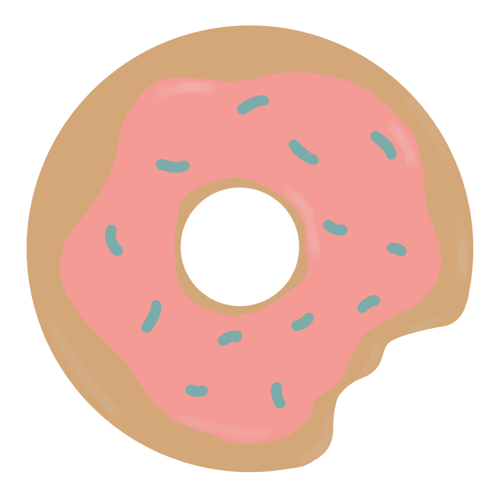

# copycake

<a href="https://copycake.pl/" target="_blank">Look on copycake</a>

## About this app

Copy Cake App was created for my girlfriend who is a copywriter. The app allows users to manage their tasks in an easy way.

Copywiters can add all of tasks that have been commissioned by their clients.
The application automatically calculates the price of the task based on the number of characters in each text written by the copywriter.
In addition, the tool generates a simple report for a specific period that can be presented to customers in PDF format.

This project was generated with [Angular CLI](https://github.com/angular/angular-cli) version 12.1.2.

## Development server

Run `ng serve` for a dev server. Navigate to `http://localhost:4200/`. The app will automatically reload if you change any of the source files.

## Code scaffolding

Run `ng generate component component-name` to generate a new component. You can also use `ng generate directive|pipe|service|class|guard|interface|enum|module`.

## Build

Run `ng build` to build the project. The build artifacts will be stored in the `dist/` directory.

